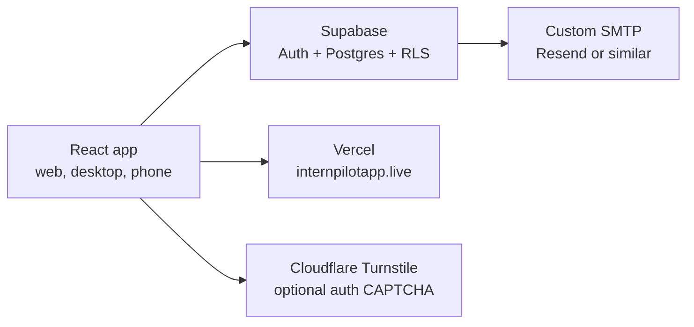

# Cloud Setup

This is the current cloud setup for InternPilot. For the full system diagram,
start with [docs/ARCHITECTURE.md](../docs/ARCHITECTURE.md).

## What The Cloud Runs



- **Vercel** hosts the static Vite build at `https://internpilotapp.live`.
- **Supabase** stores signed-in user data and handles auth.
- **Supabase Row-Level Security** keeps each account scoped to its own rows.
- **Custom SMTP** sends confirmation and password-reset emails.
- **Cloudflare Turnstile** can protect sign-in, sign-up, and password reset.

## Supabase Project

1. Create or open the InternPilot Supabase project.
2. Go to **SQL Editor**.
3. Paste all of [schema.sql](schema.sql).
4. Run it.

The schema is intended to be safe to re-run. Re-run it whenever this repo adds
tables or columns.

## Required Supabase Auth Settings

In Supabase dashboard:

1. Go to **Authentication -> Providers -> Email**.
2. For production, keep email signups enabled and turn on email confirmation.
3. Go to **Authentication -> URL Configuration**.
4. Set:

```text
Site URL: https://internpilotapp.live
Redirect URLs:
  https://internpilotapp.live
  https://internpilotapp.live/**
```

Password reset links use the current web origin in browsers. In desktop/Tauri,
the app falls back to `https://internpilotapp.live`, because normal email
clients cannot open a `tauri://` recovery URL.

## Custom SMTP

Supabase's default email sender is too limited for public usage. Configure a
real SMTP provider before opening the app to strangers.

Recommended shape:

```text
From: InternPilot <noreply@internpilotapp.live>
Provider: Resend, SendGrid, Amazon SES, or equivalent
```

After configuring SMTP:

1. Send a password reset email to a real account.
2. Confirm the email is delivered.
3. Open the link.
4. Set a new password.
5. Confirm the redirect lands on `internpilotapp.live`.

## CAPTCHA / Abuse Protection

The code supports Cloudflare Turnstile on:

- Sign-in.
- Sign-up.
- Forgot password.

To enable it:

1. Create a Turnstile site in Cloudflare.
2. Add the Turnstile secret key in Supabase Auth's CAPTCHA settings.
3. Add the public site key to the hosting environment:

```text
VITE_TURNSTILE_SITE_KEY=<your-public-site-key>
```

Do not enable Supabase CAPTCHA until the deployed frontend has this environment
variable, otherwise users can get blocked without seeing a challenge.

## Vercel Setup

The web build is a static Vite site. [../vercel.json](../vercel.json) already
sets:

- Build command: `npm run build`
- Output directory: `dist`
- SPA rewrite: every path serves `index.html`

Useful Vercel environment variables:

| Variable | Purpose |
| --- | --- |
| `VITE_SUPABASE_URL` | Supabase project URL. |
| `VITE_SUPABASE_ANON_KEY` | Public anon key. Safe to ship with correct RLS. |
| `VITE_TURNSTILE_SITE_KEY` | Enables Turnstile in auth flows. |
| `VITE_ENABLE_GMAIL_SYNC=1` | Explicitly enables Gmail sync in production web. Leave off unless ready. |

Every push to `main` can redeploy the web app if Vercel is connected to the
GitHub repo.

## What Not To Put In Vercel

Do not add these as `VITE_*` variables:

- Supabase `service_role` key.
- Database password.
- SMTP password.
- Google OAuth client secret.
- OpenAI organization/admin keys.

Anything prefixed with `VITE_` is bundled into the client.

## Schema Parity With Desktop

The cloud schema and desktop SQLite schema must stay in sync:

- Cloud schema: [schema.sql](schema.sql)
- Desktop migrations: [../src-tauri/src/lib.rs](../src-tauri/src/lib.rs)

When adding a table or column:

1. Add a new Tauri SQLite migration.
2. Mirror it in `cloud/schema.sql`.
3. Add RLS policies for user-owned cloud tables.
4. Update the matching `src/db/*` module.
5. Run the SQL in Supabase before deploying frontend code that expects it.

## Quick Production Smoke Test

After cloud or auth changes:

1. Open `https://internpilotapp.live`.
2. Create a brand-new account.
3. Complete onboarding.
4. Save a profile.
5. Browse jobs and save one application.
6. Sign out.
7. Sign in on another browser/device.
8. Confirm profile and saved application are still present.
9. Request a password reset.
10. Complete the reset link flow.

## Troubleshooting

| Symptom | Likely cause | Fix |
| --- | --- | --- |
| Sign-up says confirmation email failed | SMTP not configured or sender domain not verified | Configure SMTP and verify DNS records. |
| Password-reset link redirects to the wrong place | Supabase Site URL/Redirect URLs missing production domain | Add `https://internpilotapp.live` and wildcard redirect. |
| User can log in but data load fails | Cloud schema is behind the frontend | Re-run `cloud/schema.sql`. |
| One user can see another user's rows | RLS is missing or disabled | Stop launch, re-run schema, verify `own_rows` policies. |
| CAPTCHA blocks auth | Turnstile enabled in Supabase but no `VITE_TURNSTILE_SITE_KEY` in frontend | Add env var and redeploy, or disable CAPTCHA until deployed. |
