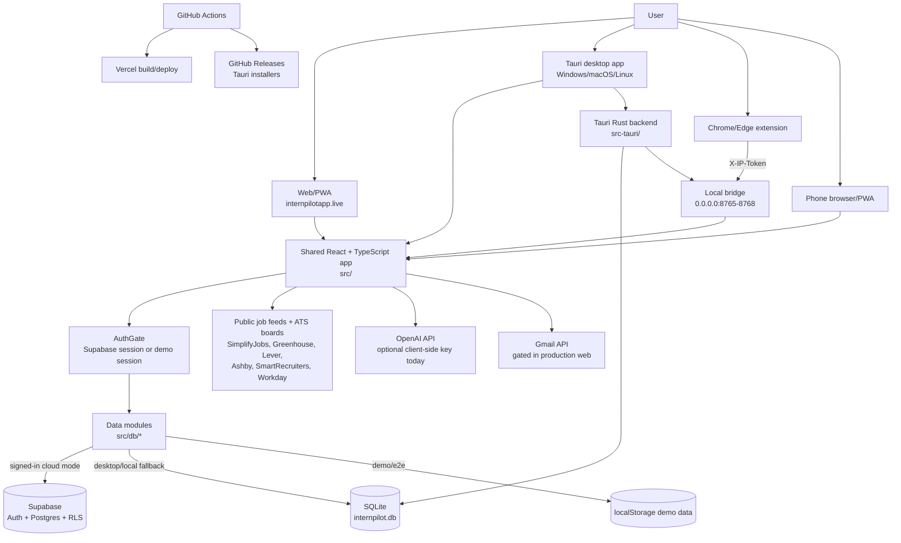
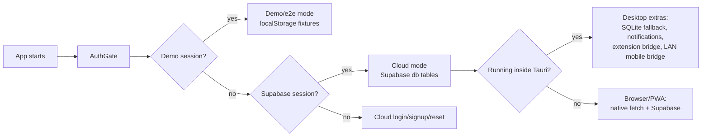
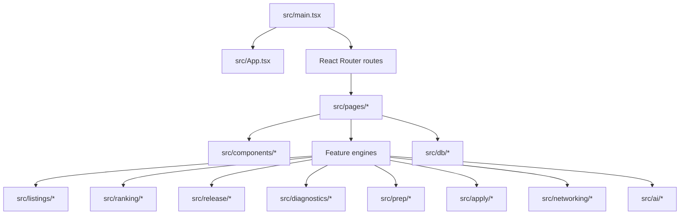
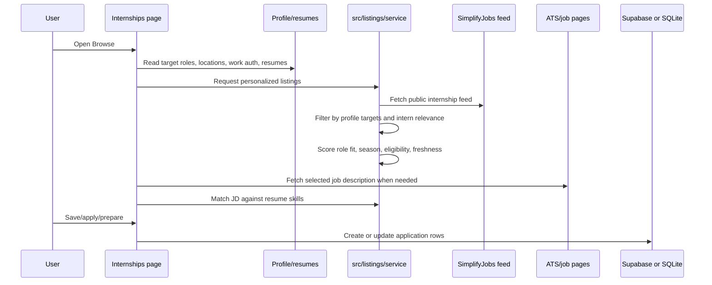
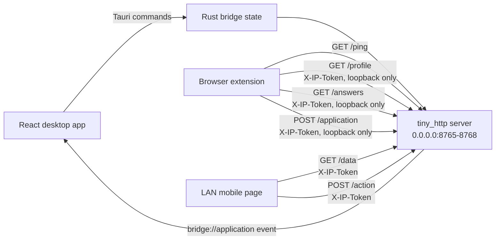
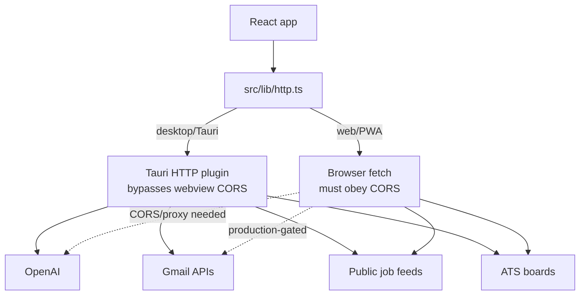
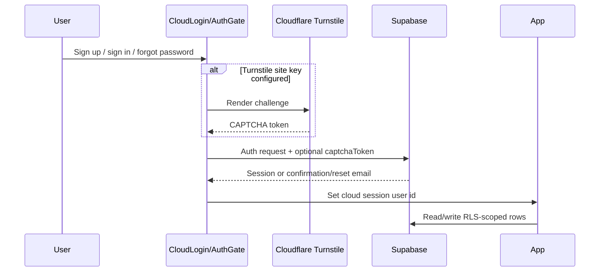
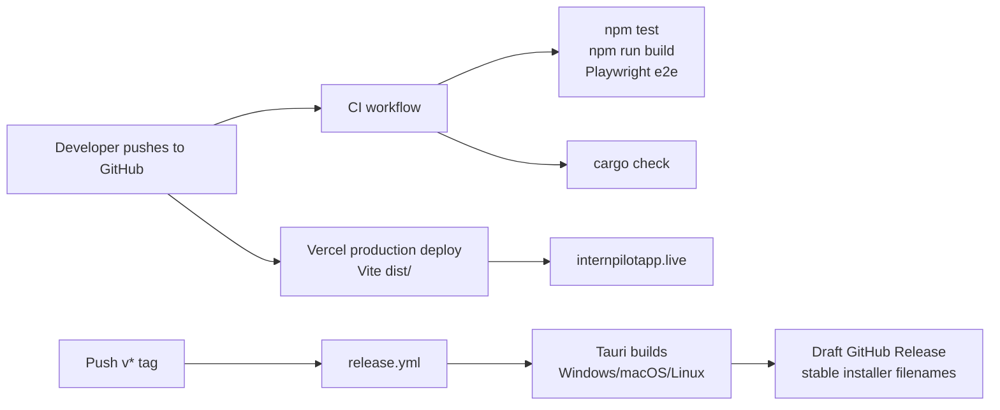
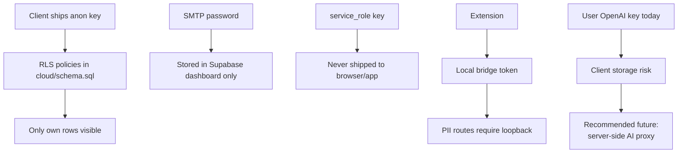

# InternPilot Architecture

This document explains how InternPilot works today: what runs in the browser,
what runs in the desktop app, where data is stored, and how the major features
talk to each other.

InternPilot has one shared React app with multiple shells:

- **Web app / PWA:** hosted on Vercel at `internpilotapp.live`.
- **Desktop app:** a Tauri 2 wrapper around the same React app, distributed from
  GitHub Releases.
- **Mobile web view:** the same Vercel web app can be installed as a PWA. The
  desktop app also serves a small LAN mobile companion page from its local bridge.
- **Browser extension:** an unpacked Chrome/Edge extension that talks only to
  the desktop app over `localhost`.

Supabase is the production cloud backend. The desktop app also keeps a local
SQLite path for offline/local operation and for desktop-only integrations.

## Big Picture



## What Is Hosted Where?

| Piece | Where it lives | What it does |
| --- | --- | --- |
| Web app | Vercel, custom domain `internpilotapp.live` | Runs the React/Vite frontend as a PWA. Uses Supabase for auth and data. |
| Cloud backend | Supabase | Email/password auth, password reset, Postgres database, Row-Level Security. Auth emails are sent through Supabase SMTP configuration. |
| Desktop app | GitHub Releases installers built by Tauri | Runs the same React app in a native webview, plus Rust plugins for SQLite, HTTP, notifications, OAuth, opener, and the local bridge. |
| Browser extension | `extension/`, installed unpacked during beta | Autofills applications and records jobs by talking to the desktop bridge. |
| CI | GitHub Actions | Runs frontend tests/build/e2e and Rust compile checks. |
| Static legal pages | `public/privacy.html`, `public/terms.html` | Served by the web build and linked from auth/settings screens. |

## Runtime Modes

The same UI can run in four useful modes:



Important files:

- [src/main.tsx](../src/main.tsx): creates the router, wraps the app in
  `ErrorBoundary` and `AuthGate`, and lazy-loads pages.
- [src/App.tsx](../src/App.tsx): renders the shell/sidebar, starts desktop-only
  tasks, and switches to the phone UI when appropriate.
- [src/components/AuthGate.tsx](../src/components/AuthGate.tsx): gates the app
  behind Supabase auth, demo mode, onboarding, and password recovery.
- [src/cloud/supabase.ts](../src/cloud/supabase.ts): creates the Supabase client
  and exposes `cloudMode()`.
- [src/lib/env.ts](../src/lib/env.ts): detects the Tauri desktop runtime.
- [src/demo/session.ts](../src/demo/session.ts): creates the demo workspace.

## Data Storage

InternPilot has three storage paths. Production users normally use Supabase.

```mermaid
flowchart TB
  ui[React page/component] --> module[src/db module<br/>applications, profile, resumes, etc.]
  module --> branch{Which mode?}

  branch -->|E2E_SMOKE or demo| ls[localStorage<br/>fixture data]
  branch -->|cloudMode() true| sb[Supabase table]
  branch -->|cloudMode() false| sql[SQLite via Tauri SQL plugin]

  sb --> rls[Row-Level Security<br/>user_id = auth.uid()]
  sql --> migrations[Rust migrations<br/>src-tauri/src/lib.rs]
```

### Supabase Cloud Data

Supabase is defined by [cloud/schema.sql](../cloud/schema.sql).

Key rules:

- Every user-owned table has a `user_id` column.
- Row-Level Security is enabled for every table.
- The main policy is `own_rows`: users can only read/write rows where
  `user_id = auth.uid()`.
- Extra trigger checks prevent cross-account foreign-key links.
- The client ships only the publishable anon key. RLS is the data boundary.

### Local SQLite Data

SQLite migrations live in [src-tauri/src/lib.rs](../src-tauri/src/lib.rs).

The local database is named `internpilot.db` and is accessed through
`@tauri-apps/plugin-sql`. It supports the desktop/local path and gives the
desktop app a place to run if no cloud session is active.

When changing the schema, update both places:

1. Add a new SQLite migration in `src-tauri/src/lib.rs`.
2. Mirror it in `cloud/schema.sql`.
3. Add the table to the RLS loop if it is user-owned.
4. Update the matching `src/db/*` module.

## Main Frontend Structure



### Page Layer

`src/pages/` contains the main screens:

- `Queue.tsx`: Fast Apply queue.
- `Internships.tsx`: Browse/discover jobs.
- `Watchlist.tsx`: target companies and priority tiers.
- `ReleaseRadar.tsx`: opening-window forecasts and live openings.
- `Dashboard.tsx`: funnel, strategy, reminders, recent activity.
- `Applications.tsx`: application tracker.
- `Profile.tsx`: user profile used for matching and autofill.
- `ResumeCenter.tsx`, `ResumeLab.tsx`, `Bullets.tsx`: resume workflows.
- `Networking.tsx`: contacts and referrals.
- `Diagnostics.tsx`: recruiting funnel diagnostics.
- `PrepEngine.tsx`, `OALab.tsx`, `InterviewPrep.tsx`: coding/OA/interview prep.
- `Settings.tsx`: account, legal links, extension settings, feature settings.

### Feature Logic

The heavier logic lives outside React components so it can be tested:

| Folder | Responsibility |
| --- | --- |
| `src/listings/` | Fetch/parse/rank job listings, read job descriptions, logos, eligibility, readiness matching. |
| `src/ranking/` | Watchlist, queue scoring, resume tracks, user feedback/preferences. |
| `src/release/` | Release Radar, historical forecasting, live ATS detection, alerts, missions. |
| `src/diagnostics/` | Recruiting funnel analysis and screening-question audit. |
| `src/prep/` | Coding pattern readiness, spaced repetition, OA diagnostics, company prep plans. |
| `src/apply/` | Application packets, answer vault, resume bullet tailoring. |
| `src/networking/` | Contact graph and best-path/referral scoring. |
| `src/ai/` | OpenAI-powered helpers with non-AI fallbacks. |

## Job Search Flow



The profile is not just display data. It affects:

- Job family filters.
- Internship/new-grad level filters.
- Season/year filters.
- Location and remote preferences.
- Work-authorization eligibility estimates.
- Resume/readiness matching.
- Autofill values sent to the extension bridge.

## Desktop Extension Bridge

The browser extension only works with the desktop app running.



Bridge details:

- Implemented in [src-tauri/src/lib.rs](../src-tauri/src/lib.rs).
- The server tries ports `8765` through `8768`.
- `/profile`, `/answers`, `/application`, and `/email` are loopback-only because
  they contain full autofill or mail data.
- `/data` and `/action` support the LAN mobile companion and require the token.
- The token is a 32-character hex string and is compared in constant time.
- Frontend bridge helpers live in [src/bridge/](../src/bridge/) and
  [src/mobile/sync.ts](../src/mobile/sync.ts).

## External Service Flow



Current external services:

- **Supabase:** auth, database, password reset, email confirmation.
- **Vercel:** web/PWA hosting and SPA rewrites.
- **Resend or other SMTP provider:** configured inside Supabase for auth emails.
- **OpenAI:** optional AI features. Today the app supports user-provided keys in
  client storage; moving AI calls server-side is a production hardening item.
- **Gmail API:** optional read-only sync. Production web builds hide/disable it
  unless `VITE_ENABLE_GMAIL_SYNC=1` is set.
- **Job sources / ATS boards:** SimplifyJobs feed and job boards such as
  Greenhouse, Lever, Ashby, SmartRecruiters, and curated Workday URLs.

## Authentication Flow



Password reset redirect behavior:

- Browser/web: redirects back to the current origin.
- Desktop/Tauri: falls back to `https://internpilotapp.live`, because a normal
  email client cannot open a `tauri://` recovery URL.

## Deployment And Release Flow



Important files:

- [.github/workflows/ci.yml](../.github/workflows/ci.yml): tests, build, e2e,
  Rust compile check. Uses Node 22.
- [.github/workflows/release.yml](../.github/workflows/release.yml): Tauri
  installer builds from `v*` tags.
- [vercel.json](../vercel.json): Vite build command, `dist` output directory,
  and SPA rewrite to `index.html`.
- [vite.config.ts](../vite.config.ts): fixed dev port `1420`, Tauri-friendly
  dev server, vendor chunk splitting.
- [src-tauri/tauri.conf.json](../src-tauri/tauri.conf.json): desktop window,
  bundle targets, and Tauri frontend build hooks.

## Environment Variables

| Variable | Used by | Purpose |
| --- | --- | --- |
| `VITE_SUPABASE_URL` | Web/desktop frontend | Supabase project URL. |
| `VITE_SUPABASE_ANON_KEY` | Web/desktop frontend | Public Supabase anon key. Safe to ship when RLS is correct. |
| `VITE_SUPABASE_KEY` | Web/desktop frontend | Legacy fallback for the anon key. Prefer `VITE_SUPABASE_ANON_KEY`. |
| `VITE_TURNSTILE_SITE_KEY` | Auth UI | Enables Cloudflare Turnstile on sign-in, sign-up, and password reset. |
| `VITE_ENABLE_GMAIL_SYNC=1` | Web production | Explicitly enables Gmail sync in production web builds. |
| `VITE_E2E_SMOKE=1` | Tests/e2e | Forces localStorage-backed smoke-test mode. |
| `TAURI_DEV_HOST` | Tauri dev | Allows testing from a device on the LAN. |

Do not put Supabase `service_role`, database passwords, Google client secrets,
SMTP passwords, or OpenAI admin keys in client-side Vite variables.

## Security Boundaries



Production-sensitive areas:

- Supabase RLS is mandatory because the anon key is public.
- Auth email confirmation, CAPTCHA, SMTP, and rate limits are ops requirements
  before broad public release.
- Gmail sync is restricted-scope OAuth and should stay gated until verification.
- OpenAI calls should eventually move behind a server-side proxy.
- Desktop installers are currently unsigned unless code signing/notarization is
  configured.

## How To Add A Feature Safely

1. Put UI in `src/pages` or `src/components`.
2. Put reusable logic in a feature folder (`listings`, `ranking`, `prep`, etc.).
3. Put persistence in a typed `src/db/*` module.
4. If schema changes are needed, update both SQLite migrations and
   `cloud/schema.sql`.
5. Add or update pure-function tests where possible.
6. Run:

```bash
npm run typecheck
npm test
npm run build
```

For desktop-affecting changes, also run:

```bash
cargo check --manifest-path src-tauri/Cargo.toml
```

## Quick Mental Model

```text
React pages are the product.
Feature folders are the brains.
src/db is the only place pages should persist data.
Supabase is production cloud storage.
SQLite is desktop/local storage.
Tauri Rust is the native bridge and desktop capability layer.
The extension never talks to Supabase directly; it talks to the desktop bridge.
Vercel hosts the web app; GitHub Releases ship the desktop app.
```
